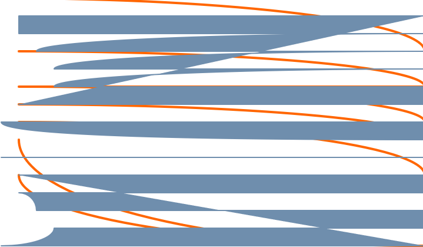

# HackerNewsCommentShuffle

Image created with [Hundred Rabits Dotgrid](https://100r.co/site/dotgrid.html)

An Egalitarian comment structure for those of us fed up with really smart people. This browser extension is currently available on Firefox. With more time, I'll incorporate the [Webextension-polyfill](https://github.com/mozilla/webextension-polyfill) for cross-browser capability. I also have plans to write tests and to transcribe this into typescript.

### Note:
This extension is not yet published on [addons.mozilla.org](addons.mozilla.org) because manifest v3 is not widely accepted as of Q4 2022.